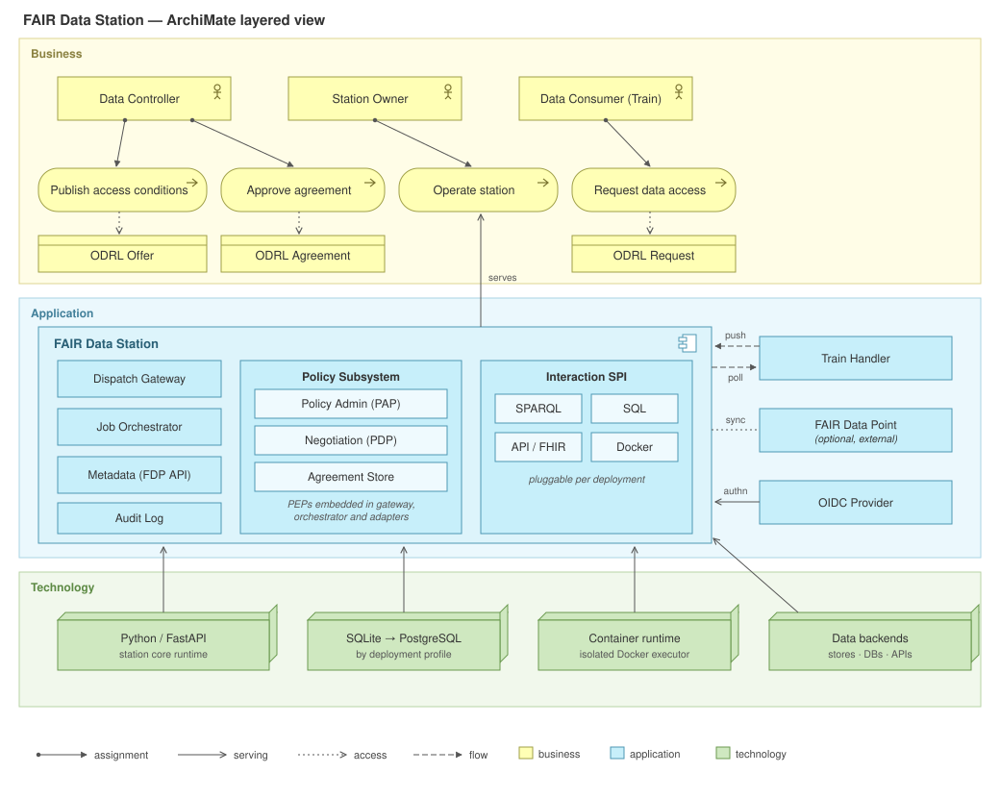
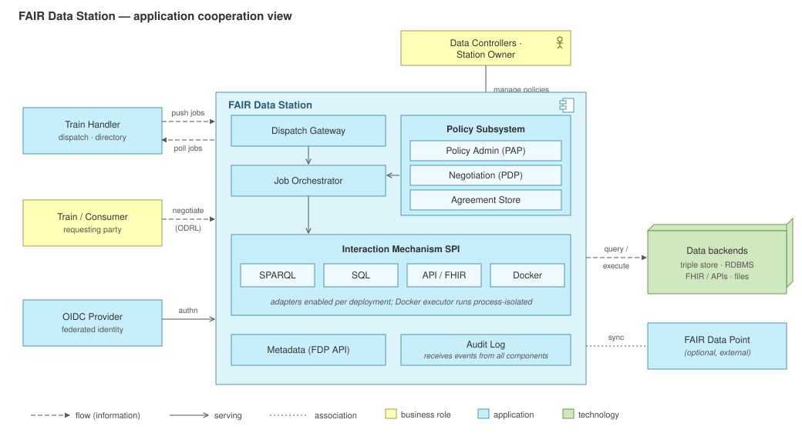
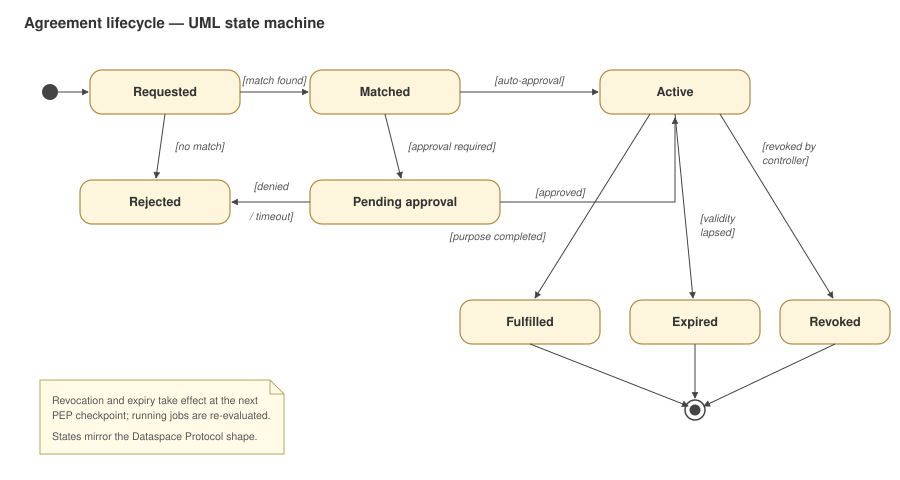
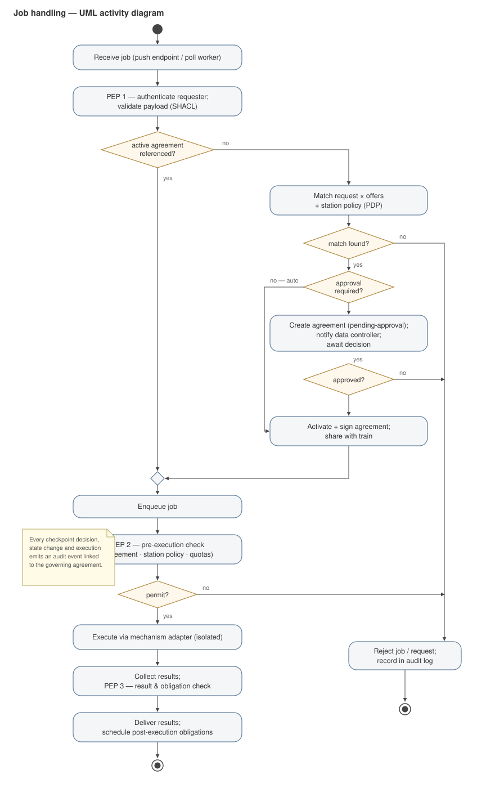
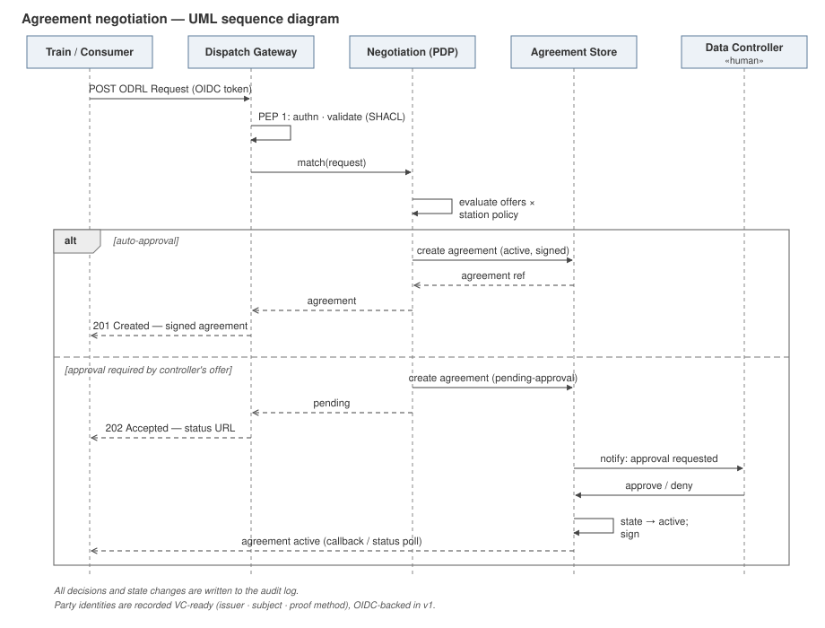
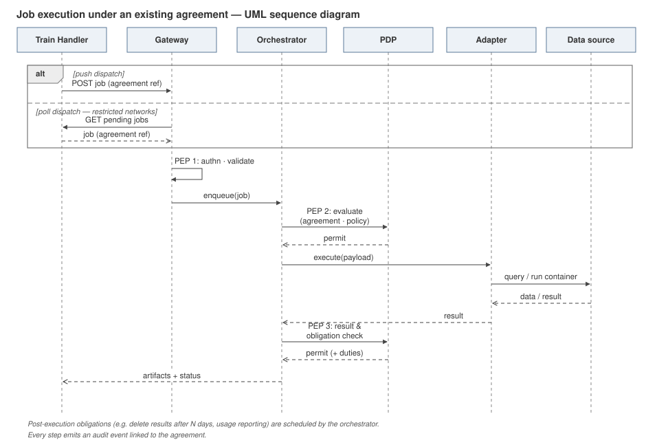

# FAIR Data Station — Architecture

| | |
|---|---|
| **Status** | Draft for discussion (v0.3 — component chapter of the **FDT Ecosystem Architecture** (`fdt-ecosystem-architecture.md`, ADR-014–024, 11 Sep 2026); Section 7.4, Principle 8 and ADR-013 added 11 Sep 2026; ecosystem-level decisions that affect the station are listed in Section 1) |
| **Date** | 2 July 2026; revised 11 September 2026 |
| **Author** | Luiz Olavo Bonino da Silva Santos (with AI assistance) |
| **Scope** | Architecture of the FAIR Data Station component of the FAIR Data Train (FDT) ecosystem |

## 1. Purpose and scope

This document captures the architecture of the **FAIR Data Station**: the node in the FAIR Data Train ecosystem that hosts data, publishes FAIR metadata about it, receives trains (computational visits), enforces access and usage policy, and returns results. It records the architectural decisions taken during the July 2026 design discussions, the rationale behind them, and the alternatives considered (Section 13, ADRs).

**Position in the ecosystem (11 Sep 2026).** This document is the component chapter for the Data Station; the ecosystem — Train Handler, Individual Gateway, Station Directory, Train Garage, Linkage and Alignment Stations, governance function, `fdt-commons` — is specified in `fdt-ecosystem-architecture.md`. Ecosystem decisions that bind the station: agreements are negotiated **per visit on arrival** (ADR-014); result inspection (PEP 3) distinguishes *results delivered to the consumer*, *state that may leave with the train* and *state returned to the orchestrator*, the last being **non-personal only** (ADR-015, ADR-016); a station may belong to **several FDT networks** and evaluates policy per network (ADR-017); the station catalogue is a **DSP-conformant `dcat:Catalog`** and offers/agreements follow DSP structural rules (ADR-019); stations may require a **train offer/attestation** at arrival (ADR-020); **LinkageStation** and **AlignmentStation** are station types with their own interaction mechanisms (ADR-022, ADR-024); station-to-station forwarding is a v2 extension (ADR-016).

The Data Station is a greenfield component. The existing FDT prototype comprises the **Train Handler** (Java 17 / Spring Boot, v0.1.0), which maintains a *registry* of stations and dispatches plans and jobs, and **FDT-O**, the FAIR Data Train ontology with SHACL shapes (including `DatastationShape.ttl`). The prototype implemented policy *checkpoints* but not the actual checks; this architecture makes those checks first-class.

## 2. Context

The FDT ecosystem follows the *data visiting* paradigm: instead of moving data to computation, computation (a **train**) travels to the data, which remains under the authority of its controller at a **station**. The ecosystem consists of:

- **Trains** — packaged data requests: a query, an API call sequence, or a container carrying an algorithm, together with metadata and an ODRL access request.
- **Train Handler** — dispatching and orchestration: plans which stations a train visits, dispatches jobs, collects artifacts, and maintains the station directory.
- **FAIR Data Stations** — this component: guarded hosts of data, described by `fdt-o:DataStation`.
- **FDT-O** — the semantic contract: ontology and SHACL shapes for stations, trains, payloads, and metadata records.
- **FAIR Data Point (FDP)** — the established specification and implementation for publishing FAIR metadata; the station exposes FDP-compliant metadata (see ADR-006).
- **Individual Gateway** *(added 11 Sep 2026; called *Personal Gateway* in the FDT specification v0.1: "application responsible to intermediate the communication between Data Stations and Data Controllers")* — the application through which **one data controller — an organisation or a natural person** — exercises control over its data across the stations that host it: authoring and revoking access conditions, reviewing agreements and the audit slice that touched their data, and — under the EHDS — exercising opt-out. It is the controller-side counterpart of the Train Handler: a multi-station client of the stations' policy administration points. For an organisation it is that organisation's own agent towards the ecosystem; for a natural person its participant status in data-space terms is open (see Section 12 and `fdt-data-space-alignment.md` A8–A9, C8, G8).

### 2.1 Roles

| Role | Authority | Notes |
|---|---|---|
| **Data Controller** | Decides *who may use the data, for what, under which conditions*. Authors ODRL offers; approves agreements where required. **An organisation or a natural person.** | A station may host data of **many** controllers. Maps to the GDPR controller concept and DPV vocabulary. A controller is an identified party to every agreement over its resources (the `assigner`), distinct from the station owner; its authority over a resource must be evidenced at onboarding (ADR-011; alignment register A1, A7). Controllers act on a station directly (controller views of the station console) or across stations through an **Individual Gateway**. |
| **Station Owner** | Operates the station: enabled interaction mechanisms, resource quotas, hosted controllers, infrastructure. | Distinct from the controller. In a personal station, owner = controller (degenerate case). |
| **Data Consumer** | The accountable party behind a train (researcher, organization). Assignee of agreements. | Identified via federated OIDC in v1; model is VC-ready (ADR-010). |
| **Train Handler operator** | Runs dispatch/orchestration infrastructure. | Not a party to agreements. |

The controller/owner separation is load-bearing: policy authorship belongs to controllers, enforcement to the station, and the effective access decision is the **conjunction** of the controller's offer and the owner's station policy.

## 3. Architecture principles

1. **Semantics first.** FDT-O and SHACL shapes are the contract; the station's self-description is derived from its actual configuration (enabled adapters ⇒ `fdt-o:supportsInteractionMechanism`), never maintained by hand.
2. **No execution without policy.** Every path to data passes policy enforcement points; adapters are unreachable except through the orchestrator, which consults the PDP.
3. **Controller sovereignty.** Controllers govern their own data on shared infrastructure; the station owner cannot override a controller's conditions, only further restrict operation.
4. **Pluggable interaction.** Execution models (query, API, container) are adapters behind one SPI; deployers choose which to enable.
5. **One architecture, many scales.** From a personal station to a hospital: same components, different deployment profile — never a different architecture.
6. **Open standards.** ODRL, FDP, DCAT, SHACL, OIDC; negotiation shaped to remain bridgeable to the IDSA Dataspace Protocol.
7. **Auditability.** Every decision, state change, and execution event is recorded and linked to the governing agreement.
8. **Domain-agnostic, cross-domain, data-space alignable** *(added 11 Sep 2026; requirements register in `fdt-data-space-alignment.md`)*. FDT is a general-purpose data-visiting platform: nothing in the station assumes health data; domain specificity enters only through profiles (ODRL profiles, DCAT-AP application profiles, identity federations). One itinerary may cross domains (e.g. hospitals and emergency transport services in the *time-to-groin* case). Every FDT element must keep a documented mapping to the IDSA architecture and Dataspace Protocol roles and to the EHDS concepts (secure processing environment, data permit), so that stations can be fronted by or embedded in data-space connectors — see `fdt-itinerary-patterns.md` §5–6.

## 4. Architecture views

### 4.1 Layered view (ArchiMate)

Business actors (controllers, owner, consumers) perform policy-related processes over ODRL business objects. The application layer is the station itself plus its ecosystem peers (Train Handler, optional external FDP, OIDC provider). The technology layer varies by deployment profile (Section 9).

### 4.2 Application cooperation view (ArchiMate)

Component responsibilities:

| Component | Responsibility |
|---|---|
| **Dispatch Gateway** | Single entry point. Push endpoint (Train Handler → station) and poll worker (station → Train Handler) converge on the same internal queue. Hosts PEP 1 (authentication, SHACL payload validation). |
| **Job Orchestrator** | Job lifecycle state machine, queueing, PEP 2/3 invocations, post-execution obligation scheduling. |
| **Policy Subsystem** | PAP (multi-tenant policy administration), Negotiation PDP (offer × request matching; runtime evaluation), Agreement Store (signed agreements, lifecycle states). |
| **Interaction Mechanism SPI** | Stable adapter contract: `describe()`, `validate(payload)`, `execute(job)`, `collect_result()`. Launch adapters: SPARQL, SQL, API/FHIR, Docker. |
| **Metadata (FDP API)** | FDP-compliant self-description and dataset metadata, including controller bindings and capacity class. |
| **Audit Log** | Append-only event log; every event references the governing agreement. |

## 5. Interaction Mechanism SPI

Each adapter implements one contract:

- `describe()` — returns the mechanism IRI (e.g. `fdt-inst:SPARQL`) and capability metadata, which the Metadata component publishes automatically;
- `validate(payload)` — mechanism-specific payload validation (on top of the generic SHACL `PayloadShape` check at PEP 1);
- `execute(job)` — runs the interaction; long-running executions report progress to the orchestrator;
- `collect_result()` — returns results/artifacts for PEP 3 inspection before delivery.

Packaging follows the **pragmatic middle path** (ADR-002): adapters are build-time modules within the station codebase, enabled per deployment by configuration. The SPI is designed as a clean, versionable interface from day one so that — once it has stabilized against several real adapters — it can be frozen into a runtime-plugin or service protocol without rework. The **Docker adapter** is the exception to in-process operation: it always runs as an isolated process with no network egress by default, resource limits, and a minimal protocol to the core (ADR-003).

## 6. Policy and security subsystem

### 6.1 ODRL model

Access governance uses ODRL 2.2 natively:

- **`odrl:Offer`** — access conditions, authored by the data controller over their resources;
- **`odrl:Request`** — carried by the train, stating the consumer, purpose, and requested actions;
- **`odrl:Agreement`** — the result of matching, signed and shared between station and train.

Domain specificity enters through **ODRL profiles**: a core FDT profile (actions such as *execute container*, *run query*; constraints such as capacity class), with domain ontologies layered per deployment — DUO + DPV being the proven combination for health/genomics data. The ODRL evaluator sits behind an internal interface (ADR-007): pragmatic matching now, adoption of the W3C ODRL formal semantics and compliance report model as they stabilize.

### 6.2 Enforcement architecture

The classic PAP/PDP/PEP/PIP separation applies. The prototype's checkpoints become the PEPs:

- **PEP 1** (Gateway): authentication, request/payload validation;
- **PEP 2** (Orchestrator, pre-execution): agreement active? station policy and quotas satisfied?
- **PEP 3** (Orchestrator, post-execution): result inspection, obligation checks before delivery.

There are **two policy moments**: negotiation time (matching produces an agreement before any job runs) and execution time (PEPs verify the running job against the agreement — validity windows, purpose, duties). Obligations extend past execution: the orchestrator schedules post-execution duties (e.g. result deletion, usage reporting) as first-class lifecycle steps.

### 6.3 Multi-tenancy

The PAP is multi-tenant: each controller authors and owns policies over their resources only; the station owner sets orthogonal station-wide policy. Every hosted resource carries its controller binding in metadata. The effective decision is the conjunction of both (Principle 3).

### 6.4 Agreement lifecycle

Matching is automated; controllers may flag resources as requiring **human approval**, which inserts the *Pending approval* state (ADR-008). Revocation by the controller and expiry take effect at the next PEP checkpoint; running jobs are re-evaluated. The state machine mirrors the shape of the IDSA Dataspace Protocol's contract negotiation so a future bridge remains cheap (ADR-009).

### 6.5 Identity

v1 uses **federated OIDC**: the station trusts configured identity providers, and the agreement records the authenticated legal party. The party model stores an identity claim set (issuer, subject, attributes, proof method) rather than a bare token subject, so W3C Verifiable Credentials can be adopted without schema migration (ADR-010).

## 7. Runtime behavior

### 7.1 Job handling (UML activity)

### 7.2 Agreement negotiation (UML sequence)

### 7.3 Job execution under an existing agreement (UML sequence)

### 7.4 Multi-station itineraries: orchestration and choreography

The flows above describe **one visit**. Real analyses often require a train to visit several stations, and the ecosystem must support several *itinerary patterns* — collected and analysed in the companion working document `fdt-itinerary-patterns.md`. Two ends of the spectrum illustrate the requirement:

- **Static fan-out** (prototype `Plan`): the same train is sent simultaneously to a set of stations chosen before dispatch; jobs are independent.
- **Discovery chain** — the *time-to-groin* case for stroke care: to compute the interval between symptom onset and groin puncture for endovascular thrombectomy — which Dutch EVT centres must register (NVN/NVvR criteria 2021) and whose components carry official norms (median door-to-groin < 30 min for referred and < 75 min for direct patients; ambulance call-to-centre within 45 min for 80 % of suspected strokes) — a train must first visit an EVT centre (treated patients, groin and door times, referring hospital, ambulance service), then the ambulance service's station (call, on-scene and hand-over times, pick-up place), then the referring primary stroke centre, and so on until the onset time is found. Neither the train nor the Train Handler knows the route in advance; it is discovered at each visited station. The case is documented with its sources in `fdt-use-case-time-to-groin.md`.

Dynamic itineraries can be realised in two coordination styles, and **both must be supported** (ADR-013):

| Style | Coordinator | Route logic lives in | Train types | Station impact |
|---|---|---|---|---|
| **Orchestration** | An external element, typically the Train Handler | Handler (reads hop results, issues next jobs) | All, including query/API trains, which cannot carry logic | None beyond single-visit behaviour; result inspection (PEP 3) decides what the Handler may receive |
| **Choreography** | The train itself | Routing algorithm embedded in a script/container train | `fdt-o:ScriptTrain`, `fdt-o:ContainerTrain` only | Station must let a train discover next hops and either forward it to a peer station or return it to the Handler with a routing instruction; PEP 3 must judge what may *travel onward inside the train*, not only what is delivered to the consumer |

Ecosystem elements may play the roles of *orchestrator* and *choreographer*; the Train Handler is the default orchestrator, but a station may act as one (e.g. an aggregator station in hierarchical patterns) and a train may act as choreographer. Design drivers selected for the Handler are the discovery chain (P4), iterative rounds as in federated learning (P5), two-phase conditional dispatch (P7) and composition of dependent trains (P8), alongside static fan-out (P2).

Consequences for the station architecture, to be worked out per pattern: (i) **agreement scope** for multi-hop runs — negotiated per hop on arrival (fits ADR-008, but a run may stall in *pending approval* mid-chain) versus chain-level up front; (ii) **state that travels between hops** as a distinct policy object from delivered results; (iii) **record linkage across organisations**, possibly via a pseudonymisation/trusted-third-party element; (iv) **station-to-station forwarding** for choreographed hops, which turns a station into a dispatcher towards its peers; (v) run-level **provenance** (PROV-O) of the itinerary as executed. These are tracked in Section 12.

## 8. Metadata

The station serves **FDP-compliant** metadata endpoints itself (embedded), conforming to the FDP specification rather than reusing the Java reference implementation (ADR-006); sites that already operate an FDP can optionally synchronize with it. Self-description includes: the `fdt-o:DataStation` record with owner, the supported interaction mechanisms **derived from enabled adapters**, per-resource controller bindings, links to ODRL offers, and a **capacity class** so the Train Handler can plan dispatch across stations of very different sizes.

## 9. Technology and deployment profiles

Core stack: **Python 3.12+ / FastAPI**, typed end-to-end (pydantic models, `mypy --strict`), RDF via rdflib, SHACL via pySHACL, OIDC via standard libraries, Docker SDK for the container executor (ADR-001).

| Profile | Example | Database | Queue | Identity | Adapters |
|---|---|---|---|---|---|
| **Personal** | Individual's activity data | SQLite (embedded) | in-process | external OIDC (e.g. public IdP) | typically query-only |
| **Team / institute** | Research group server | PostgreSQL | in-process workers | institutional OIDC | query + API |
| **Enterprise** | Hospital | PostgreSQL (HA) | external queue, scaled workers | institutional IdP, strict egress | all, incl. Docker |

Same codebase and components in every profile; only configuration differs (Principle 5). The station runs as a single container by default; the Docker executor as a sidecar process/container.

## 10. Repository and code organization

- **`FAIRDataStation`** (new repository): station core + adapter modules (monorepo of Python packages: `core`, `policy`, `metadata`, `adapters/{sparql,sql,api,docker}`).
- **`fdt-commons`** (new repository): *language-neutral* shared artifacts — SHACL shapes, ODRL profile, OpenAPI schemas, JSON-LD contexts — consumed by station, Train Handler, and tooling.
- Both added as submodules of the **`FAIRDataTrain`** metaproject.

The Train Handler needs one addition for poll dispatch: a "pending jobs for station X" endpoint (its job/artifact API is close already).

## 11. Ontology work items (FDT-O)

1. **`DataController`** as a concept distinct from the existing `StationOwner`, plus the resource–controller relation (`fdt-o:isControlledBy` currently conflates station control; the data-authority relation must be separate).
2. **FDT ODRL profile**: FDT-specific actions, constraints (mechanism, capacity class), and party roles; alignment hooks for DUO/DPV.
3. **Capacity/size class vocabulary** for station self-description.
4. Review `DatastationShape.ttl` against this architecture (e.g., controller bindings, agreement references).

## 12. Open issues

- Result egress rules for query adapters (k-anonymity/aggregation thresholds as ODRL duties?).
- Provenance of results (PROV-O records linking artifact → job → agreement → train).
- Train vetting beyond type allowlists: signed trains, trusted train garages.
- Trust model for station registration in directories.
- Revocation propagation latency guarantees for long-running container jobs.
- Individual Gateway (for any single controller, company or person): for organisations it is the participant's own agent; for natural-person controllers the participant status is open (the IDSA Rulebook admits only legal organisations as participants — a gateway operator as participant with the person as rights holder is the alignable option), person-level identity (eIDAS 2 / EUDI Wallet, to be verified), representation of the individual's conditions as ODRL offers attached to their resources on several stations, opt-out propagation to running and future jobs, and the relation to the station console's controller views and to the *personal station* profile (ADR-012).
- Data-space alignment requirements (register `fdt-data-space-alignment.md`, candidate ADR-014–017): DSP-conformant catalogue and state-machine mapping; trains as contracted assets; FDT governance authority for participation and trusted issuers (DCP/VC phase of ADR-010); SPE-conformant station profile for EHDS secondary use (2029); DGA position of Handler/Directory/Garage operators; Data Act Art. 33 conformance of station metadata.
- Cross-domain interoperability and data-space alignment (Principle 8): join-key declaration per dataset in FDT-O; several ODRL profiles in one agreement chain; multi-federation identity; depth of IDSA/DSP mapping (mapping only, connector-embeddable station, or asset/contract representation); EHDS data-permit workflow as the *pending approval* state.
- Multi-hop itineraries (Section 7.4): agreement scope per hop vs chain-level; policy on state carried between hops; record linkage across stations (TTP/pseudonymisation element?); station-to-station forwarding for choreographed trains; itinerary vocabulary (targets, phases, dependencies, stop conditions, budgets) in FDT-O / `fdt-commons`.

## 13. Architecture Decision Records

Format: **Status · Context · Decision · Alternatives considered · Consequences** (condensed).

### ADR-001 — Python + FastAPI for the station core
**Status:** Accepted (2026-07-02). **Context:** No predetermined stack; team to be hired; community adapter contributions expected from the FAIR/research-data world; no obligation to follow the Java prototype. **Decision:** Python 3.12+/FastAPI, mandatory typing (pydantic, mypy strict). **Alternatives:** Java/Kotlin (best RDF/SHACL stack — RDF4J/Jena/TopBraid — and direct FDP code reuse, but slower iteration and smaller contributor pool); TypeScript/Node (Comunica/TPF strength, but SHACL Core-only and fewer domain contributors); Go (operationally excellent, but RDF/SHACL ecosystem too thin for a semantics-centric component). **Consequences:** rdflib/pySHACL are slower than RDF4J — acceptable because the station fronts data sources rather than hosting large graphs; FDP reuse becomes spec conformance (ADR-006); discipline enforced via strict typing.

### ADR-002 — Build-time adapter modules behind a stable SPI ("pragmatic middle path")
**Status:** Accepted. **Context:** Deployers must choose supported execution models; third-party mechanisms desirable eventually; SPI will evolve during early development. **Decision:** Adapters are build-time modules enabled by configuration; the SPI is a clean, versioned interface from day one. Revisit runtime plugins/service protocol after the SPI survives 3–4 real adapters. **Alternatives:** runtime plugins (ecosystem extensibility, but freezes the plugin API prematurely and adds sandboxing burden); separate services per adapter (language freedom and isolation, but N+1 containers and an internal protocol from day one — conflicts with easy deployment). **Consequences:** contributing a mechanism initially requires a core-repo contribution; migration path to plugins is mechanical, the reverse is not.

### ADR-003 — Docker executor is process-isolated from the start
**Status:** Accepted. **Context:** Container execution is the riskiest interaction mechanism. **Decision:** The Docker adapter shells out to an isolated executor process (default: no network egress, resource limits); its boundary is a minimal internal protocol. **Consequences:** a crashing or compromised execution cannot take down the core; the executor's implementation language can change independently if ever warranted.

### ADR-004 — Support both push and poll dispatch
**Status:** Accepted. **Context:** Hospitals and firewalled sites often cannot accept inbound connections; the prototype assumed push. **Decision:** Push endpoint and poll worker both feed one internal queue; identical processing beyond the gateway. **Consequences:** Train Handler needs a pending-jobs endpoint; stations choose their mode per network posture.

### ADR-005 — New `FAIRDataStation` repo + language-neutral `fdt-commons`
**Status:** Accepted. **Context:** Reuse across FDT applications without code duplication; polyglot ecosystem after ADR-001. **Decision:** Station in its own repository; shared *spec artifacts* (shapes, ODRL profile, OpenAPI schemas, JSON-LD contexts) in `fdt-commons`; both as submodules of the metaproject. **Alternatives:** shared Java libraries (invalidated by ADR-001); single monorepo (couples release cycles). **Consequences:** cross-language consistency is enforced at the artifact level, not the code level.

### ADR-006 — Conform to the FDP specification; do not reuse FDP code
**Status:** Accepted. **Context:** FDP metadata functionality is "solved", but the reference implementation is Java. **Decision:** The station embeds FDP-compliant metadata endpoints implemented in the station stack; deployments may additionally sync to an external FDP. **Consequences:** one reimplementation of the FDP API surface; full independence from the Java lineage; conformance validated against the FDP spec test expectations.

### ADR-007 — ODRL for conditions, requests, and agreements; evaluator behind an interface
**Status:** Accepted. **Context:** Access conditions (station/controller), access requests (trains), and access agreements (shared) must be machine-actionable; W3C ODRL formal semantics are still being standardized (active CG work, 2026). **Decision:** Use `odrl:Offer` / `odrl:Request` / `odrl:Agreement` natively; domain specificity via ODRL profiles (FDT core profile; DUO+DPV for health). The evaluator/matcher is a replaceable internal component. **Consequences:** pragmatic matching semantics initially, documented explicitly; upgrade path to standardized evaluator semantics and compliance reports without API change.

### ADR-008 — Automated matching with optional human-in-the-loop approval
**Status:** Accepted. **Decision:** Matching runs automatically at request arrival; a controller's offer may flag resources as requiring manual approval, inserting a *pending-approval* state. Negotiation is asynchronous for trains in all cases. **Alternatives:** pre-arranged agreements only (safer but not machine-actionable at scale); fully automated only (no controller comfort for sensitive resources). **Consequences:** agreement lifecycle needs notification and timeout handling; trains must handle deferred outcomes.

### ADR-009 — Align negotiation with the Dataspace Protocol "where cheap"
**Status:** Accepted. **Context:** IDSA DSP / Eclipse EDC also negotiate ODRL offer→request→agreement. **Decision:** Mirror DSP's asynchronous state-machine shape and ODRL payloads; do not adopt the full protocol now. **Consequences:** a future DSP bridge (e.g. toward Gaia-X / EHDS-adjacent infrastructures) is a mapping exercise, not a redesign.

### ADR-010 — Federated OIDC now; VC-ready party model
**Status:** Accepted. **Decision:** Stations trust configured OIDC providers; agreements record the authenticated legal party as an identity claim set (issuer, subject, attributes, proof method). **Consequences:** W3C Verifiable Credentials can be introduced later by adding an issuer type — no agreement schema migration.

### ADR-011 — Data controller ≠ station owner; multi-tenant policy administration
**Status:** Accepted. **Context:** Stations host data from many providers; authority over data and control of infrastructure are different concerns. **Decision:** Controller and owner are distinct first-class roles; the PAP is multi-tenant; effective decisions are the conjunction of controller offer and owner station policy; every resource carries a controller binding. **Consequences:** FDT-O extension required (Section 11); personal stations work as the single-tenant degenerate case.

### ADR-012 — One architecture, deployment profiles for scale
**Status:** Accepted. **Context:** Stations range from personal devices to hospital infrastructure. **Decision:** No mandatory heavy dependencies: embedded defaults (SQLite, in-process queue, external OIDC) scaling by configuration to PostgreSQL, external queues, HA workers. Stations advertise a capacity class. **Consequences:** core code must remain infrastructure-agnostic behind thin persistence/queue interfaces.

### ADR-013 — Support both orchestrated and choreographed multi-station itineraries
**Status:** Accepted in principle (2026-09-11); realisation per pattern pending the itinerary-pattern analysis (`fdt-itinerary-patterns.md`). **Context:** Analyses such as *time-to-groin* require trains to visit a sequence of stations that is discovered hop by hop; other patterns (iterative rounds, two-phase conditional dispatch, dependent trains) need coordination across visits. Query and API trains carry no logic and can only be coordinated externally; script and container trains can embed routing. **Decision:** The ecosystem supports **orchestration** (an external coordinator — by default the Train Handler — decides successive visits from hop results) **and choreography** (the routing algorithm is embedded in the train). Ecosystem elements may play orchestrator and choreographer roles; the station remains agnostic to who coordinates but must expose what each style needs. **Alternatives:** orchestration only (simpler stations, but forces every analysis through a Handler that sees intermediate results and excludes autonomous container trains); choreography only (excludes all query/API trains). **Consequences:** the station's result-inspection checkpoint (PEP 3) must distinguish *results delivered to the consumer* from *state travelling onward*; agreement lifecycle must accommodate multi-hop runs (scope and mid-chain approvals); station-to-station forwarding and run-level provenance become design items; the Handler's `Run` model evolves from a set of independent jobs to dependent jobs/phases.

## 14. References

- FDT Ecosystem Architecture — `fdt-ecosystem-architecture.md` (same folder, v0.1; ADR-014–024).
- Itinerary pattern catalogue — `fdt-itinerary-patterns.md` (same folder, working draft v0.4).
- Reference use case — `fdt-use-case-time-to-groin.md` (same folder, sourced from Dutch guidelines, quality standards, registries and law).
- Data-space alignment requirements register — `fdt-data-space-alignment.md` (same folder; IDSA Rulebook 2026-2, DSP 2025-1, DCP 1.0, Gaia-X 3.1, DSSC Blueprint 3.0, Simpl, Data Act, DGA, EHDS).
- FDT-O ontology and shapes — `FDT-O` repository (`fdt-ontology.owl`, `shapes/DatastationShape.ttl`).
- Train Handler prototype — `TrainHandler-server` repository (v0.1.0).
- FAIR Data Point specification — https://github.com/FAIRDataTeam/FAIRDataPoint-Spec
- ODRL Information Model 2.2 — https://www.w3.org/TR/odrl-model/
- ODRL implementation landscape & formal semantics work — https://w3c.github.io/odrl/landscape/
- Pandit & Esteves, *Enhancing DUO for health-data sharing by extending it with ODRL and DPV*, Semantic Web (2024) — https://journals.sagepub.com/doi/full/10.3233/SW-243583
- Data Privacy Vocabulary (DPV) — https://w3c.github.io/dpv/
- IDSA Dataspace Protocol — https://docs.internationaldataspaces.org/ids-knowledgebase/dataspace-protocol
- Diagram sources: `diagrams/src/*.puml` (PlantUML; SVGs in `diagrams/` were produced manually and can be regenerated from the sources).
