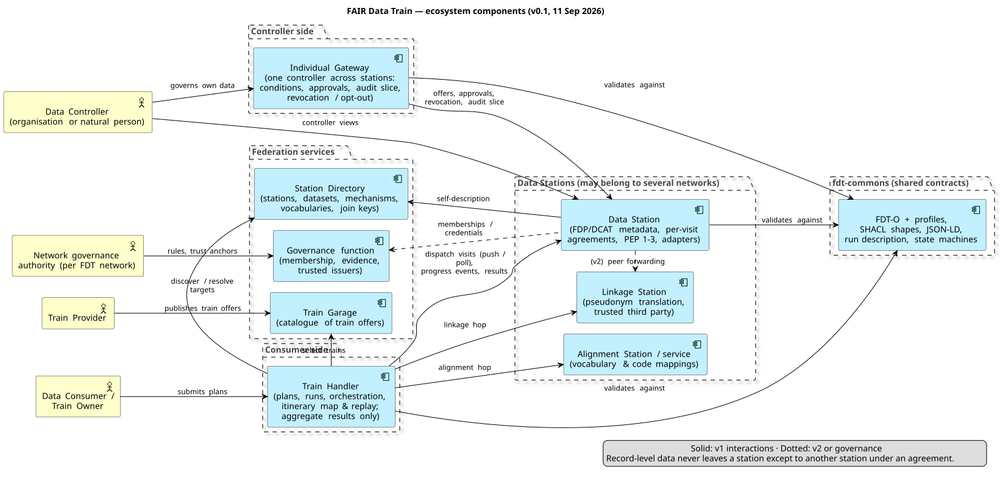

# FAIR Data Train — Ecosystem Architecture

| | |
|---|---|
| **Status** | Draft for discussion (v0.1.4 — ADR-020 amended and FDT-O v2 delta 11 Sep 2026; ADR-025 condition grammar and ADR-026 failure semantics accepted 12 Sep 2026; ADR-027 visit protocol v1 draft 1) |
| **Date** | 11 September 2026 |
| **Author** | Luiz Olavo Bonino da Silva Santos (with AI assistance) |
| **Scope** | Architecture of the FAIR Data Train (FDT) ecosystem as a whole: its components, roles, networks and governance, the interactions between components, the shared contracts, and the decisions taken on 11 September 2026 (ADR-014 to ADR-024). The **FAIR Data Station** is specified in its own component document, `fair-data-station-architecture.md` (v0.2.2), which this document supersedes only where the two overlap at ecosystem level |
| **Companion documents** | `fair-data-station-architecture.md` (station component; ADR-001–013) · `fdt-itinerary-patterns.md` v0.3 (patterns P1–P10) · `fdt-use-case-time-to-groin.md` (reference case) · `fdt-data-space-alignment.md` v0.3 (requirements register) · `fdt-commons/` v0.2 (probe: shapes, vocabularies, examples, `FINDINGS.md`) · `fair-data-station-ui-design-brief.md` and the mock-up canvas |

## 1. Purpose

The FDT specification v0.1 (specs.fairdatatrain.org) defines the ecosystem's elements at the level of interfaces and behaviours; the July 2026 work specified one component, the Data Station, in depth. The September 2026 discussions added requirements that only make sense at ecosystem level — multi-station itineraries with orchestration and choreography, an Individual Gateway, federated governance, linkage and alignment services, domain-agnosticism with cross-domain interoperability, and alignability with the European data-space stack. This document gives those elements one home, records the decisions as ADRs, and defines what must be shared between components (`fdt-commons`) for independently built stations, handlers and gateways to interoperate.

## 2. Ecosystem principles

The station principles (semantics first; no execution without policy; controller sovereignty; pluggable interaction; one architecture, many scales; open standards; auditability; domain-agnostic, cross-domain, data-space alignable) hold for the ecosystem. Five are added or sharpened here.

1. **Data visiting.** Computation travels to the data; record-level data never leaves the station that hosts it except to another station under an agreement. The Train Handler holds non-personal, aggregate results at most (ADR-015).
2. **Every visit is an agreement.** Each station visit — including visits to linkage and alignment stations — is governed by its own ODRL agreement negotiated on arrival (ADR-014); the run-level view is provenance over those agreements, not a super-agreement.
3. **Coordination is not a property of the station.** A station behaves identically whether a visit is orchestrated by a Handler, chosen by a train carrying its own routing, or (from v2) forwarded by a peer station (ADR-013, ADR-016).
4. **Federated governance.** FDT defines the governance *function* and its interfaces; every FDT network runs its own governance authority, and a station may belong to several networks at once (ADR-017).
5. **Shared contracts, independent implementations.** Interoperability rests on `fdt-commons` — vocabularies, shapes, schemas, state machines — not on shared code (ADR-005, ADR-019, ADR-023).

## 3. Roles

| Role | Party | Notes |
|---|---|---|
| **Data Controller** | **An organisation or a natural person** with authority over data hosted at one or more stations | Authors access conditions (ODRL offers), approves agreements where required, may revoke; identified party (`assigner`) of every agreement over its resources, distinct from the station owner (ADR-011). Acts through the station console or, across stations, through an **Individual Gateway** |
| **Station Owner** | Organisation (or a person, in the personal profile) operating a station | Sets station-wide policy orthogonal to controller conditions; effective decision = controller offer ∧ owner policy |
| **Data Consumer / Train Owner** | Party accountable for a run | `assignee` of agreements; submits trains via a Handler |
| **Train Provider** | Party that creates and publishes trains | Offers trains as contracted assets through a Garage (ADR-020) |
| **Train Handler operator** | Runs dispatch/orchestration infrastructure | Not a party to agreements; may see aggregate results only (ADR-015); DGA position to be checked per deployment |
| **Station Directory operator**, **Train Garage operator** | Run federation catalogues | Directory indexes stations and datasets; Garage indexes trains and their offers |
| **Linkage service provider**, **Alignment service provider** | Operate linkage / alignment stations | Trusted third parties for identifier translation; vocabulary/mapping services (ADR-022, ADR-024) |
| **Network governance authority** | Per FDT network | Participation rules, evidence categories, trusted issuers, trust anchors (ADR-017) |

## 4. Components

| Component | Responsibility | Status |
|---|---|---|
| **Data Station** | Hosts data, publishes FAIR metadata (FDP/DCAT, DSP-conformant catalogue), receives trains, negotiates per-visit agreements, enforces policy at three checkpoints, executes through interaction-mechanism adapters, returns inspected results or lets inspected state travel onward. Specified in `fair-data-station-architecture.md` | Greenfield, specified |
| **Train Handler** | Consumer-side agent: train selection and parametrisation, plan and run management, dispatch (push/poll), **orchestration** of multi-station itineraries (fan-out, sequence, discovery chain, rounds, phases, composition), collection of non-personal results and provenance, itinerary map and replay | Java prototype exists (v0.1.0); to be redesigned around the run model of §6 |
| **Individual Gateway** | Controller-side agent for **one controller — a company or a person** — across all stations hosting its data: author and revoke conditions (multi-station PAP client), review agreements and the audit slice that touched its data, receive approval requests, exercise opt-out. FDT spec v0.1 calls it the *Personal Gateway* | New component |
| **Station Directory** | Federation catalogue of stations and datasets (DCAT), searchable by interaction mechanism, domain profile, vocabularies and **join keys**; resolves query-defined target sets (P2b); a station may be indexed by several directories | Prototype concept; extend |
| **Train Garage** | **Catalogue of train offers** (ADR-020): an FDT-O `GarageCatalog` (a `dcat:Catalog`) listing trains via `dcat:resource` — each train an `odrl:Asset` with its provider's `odrl:Offer` (licence, permitted purposes/stations), an FDT-O `Payload` with digest, provenance, declared parameters, outputs, mechanisms and coordination styles. Trains are **never** `dcat:Dataset`s | Prototype concept; redefine |
| **Linkage Station** | A station type (ADR-022) whose interaction mechanism is identifier translation between organisational pseudonym spaces; visited as a hop under its own agreement; wraps existing trusted third parties | New station type in FDT-O |
| **Alignment Station / service** | Reusable vocabulary and mapping services (code systems, spatial/administrative units) discoverable via the Directory and consulted by trains or visited as hops (ADR-024) | New station type / service in FDT-O |
| **Governance function** | Per network: participation onboarding, evidence, trusted issuers, trust anchors, rule publication; exposes machine-readable membership so stations and handlers can check who belongs to which network | Organisational + thin technical component |
| **fdt-commons** | Language-neutral shared contracts: FDT-O and profiles, SHACL shapes, JSON-LD contexts, OpenAPI/JSON schemas, state machines and their DSP mappings, run-description vocabulary | New repository (ADR-005) |

Trains remain what they were — packaged, executable interactions of four families (query, API, script, container) — but gain an identity and an offer of their own (ADR-020). They are modelled as assets and catalogue resources, not as datasets: a train is something a station runs, not something it hosts.

## 5. Networks and governance

An **FDT network** is a set of participants (stations, handlers, gateways, directories, garages, service stations) that accept one governance authority's rules and trust anchors. Because a station frequently serves several communities — a hospital station in a regional acute-care network, a national research infrastructure and a European health data space at once — **a station may participate in multiple networks with different governances** (ADR-017). Consequences:

- The station's self-description lists its **memberships** (network identifier, governance authority, credentials held, validity), so a Handler in network X knows whether a station accepts trains from X.
- Policy evaluation is **per network**: a controller's offer may differ per network (different profiles, e.g. DUO+DPV in a health network and a licence profile in an open-data network), and the owner's station policy may restrict which networks may use which mechanisms.
- Agreements record the network under which they were concluded; audit and provenance are partitioned accordingly.
- Identity is issued by network authorities, not by FDT: in v1 through federated OIDC providers the network trusts; from v2 through DCP credentials whose trusted-issuer lists the authority maintains (ADR-019; register A2–A4).

## 6. Interactions and the run model

### 6.1 Plan, run, visit

A **plan** names a train, its parameter values, an **itinerary** (pattern, entry stations or a directory query, phases/dependencies, stop conditions, budget) and the consumer's purpose (the ODRL request template). A **run** is one execution of a plan; a **visit** (job) is one train execution at one station under one agreement. Runs are recurring when scheduled (P9).

### 6.2 Coordination

Both **orchestration** and **choreography** are supported (ADR-013). In v1 the orchestrator is the Train Handler or an orchestrator station; a choreographing train returns to the Handler between hops with a routing instruction (the Handler dispatches the next visits); direct **station-to-station forwarding** is designed for but not implemented in v1 (ADR-016). Query and API trains are always orchestrated; script and container trains may choreograph.

### 6.3 Agreements

**Per hop, negotiated on arrival** (ADR-014). A visit may enter *pending approval*; the run shows "waiting for approval at X", continues other branches, and applies the plan's failure policy (ADR-026: reactions per outcome, completeness threshold). The run-level record is a PROV-O provenance graph over the visits and their agreements.

### 6.4 State between hops

Three mechanisms, all supported, chosen per plan and constrained by the stations' policies (ADR-016): (a) **inside the train** — a container/script train carries state; the origin station's result inspection (PEP 3) judges *what may leave with the train*, a policy object distinct from *what is delivered to the consumer*; (b) **via the orchestrator** — only non-personal state (counts, aggregates, next-hop lists, opaque pseudonyms) returns to the Handler and is re-injected as parameters (ADR-015); (c) **via a linkage station** — only opaque pseudonyms cross organisational boundaries and are translated by the trusted third party (ADR-022).

### 6.5 Pattern support

| Pattern (catalogue) | v1 | v2 |
|---|---|---|
| P1 single visit, P2 fan-out, P2b query-defined fan-out, P9 recurring | ✓ | |
| P7 two-phase conditional (aggregate condition at the Handler) | ✓ | |
| P3 sequence, P8 composition (orchestrated; state via orchestrator or train) | ✓ | |
| P4 discovery chain (orchestrated; linkage station; per-record branching; budget) | ✓ core | tree-scale optimisation |
| P5 iterative rounds (aggregator = Handler or aggregator station) | design | ✓ |
| P6 hierarchical aggregation (aggregator station role) | design | ✓ |
| P10 station referral / peer forwarding | design | ✓ |

### 6.6 Progress, map and replay

Stations emit progress and compliance events per visit (arrival, agreement state, execution, inspection outcome, delivery, obligations scheduled); the Handler renders the itinerary map live and stores the event stream with the provenance record so a finished run can be replayed step by step. Individual Gateways receive the events that concern their controller's resources.

## 7. Shared contracts (`fdt-commons`)

| Contract | Content | Alignment |
|---|---|---|
| **Metadata** | Station, dataset and service descriptions: FDP/DCAT-AP core with domain profiles; hosted data typed FDT-O `HostedDataset` (⊑ `dcat:Dataset`) in a `StationCatalog`, so hosted-data rules never fire on train-output descriptions; per dataset the interaction mechanisms, controller binding, **vocabularies and join keys**, network memberships, processing location, capacity class | DSP-conformant `dcat:Catalog`: one `odrl:Offer` per dataset, `dcat:Distribution` per mechanism, `dcat:DataService` = dispatch endpoint (ADR-019); Data Act Art. 33 descriptions |
| **Policy profile** | FDT ODRL profile: access / contract / usage policy kinds; actions (run query, execute container, translate identifiers, …); constraints (purpose, consumer type, mechanism, network, allowed trains/garages, processing location); duties (deletion, aggregation threshold, reporting, no re-identification); domain layers (DUO+DPV for health) | DSP structural rules for offers/agreements (unique ids, `target`, `assigner`, `assignee`, `timestamp`) as SHACL shapes (ADR-019) |
| **Train description** | Train as `odrl:Asset` + `dcat:Resource` (never `dcat:Dataset`) with its provider's `odrl:Offer`: type and mechanism, parameter schema, declared outputs, dependencies, executable artefact as FDT-O `Payload` (media type, download URL, sha256 digest), supported coordination styles, provenance, licence and permitted purposes/stations; catalogued by a `GarageCatalog` via `dcat:resource` | IDS Data App requirements; Rulebook "data asset containing code" (ADR-020). Not a DSP catalogue entry (DSP Catalog knows only `dcat:Dataset`); a Garage is an FDT catalogue |
| **Run description** | Vocabulary + shapes + JSON-LD for plans, itineraries, phases, dependencies, stop conditions, budgets, state-carriage choice, join keys used (ADR-023); conditions as JMESPath predicates/selectors over the visit-result and run-state JSON envelopes (ADR-025) | Expressible as DSP/ODRL where overlapping |
| **Visit protocol (data plane)** | **Specified — `fdt-commons/protocol/` (ADR-027):** visit descriptor, visit events with justification chains, result envelope (= ADR-025 `VisitResult`), Station API and Handler API (push and poll), OpenAPI 3.1 + JSON Schema, fixtures for the time-to-groin hop 1 | DSP Transfer Process state mapping (ADR-019); FDT's own binding |
| **State machines** | Agreement (requested → matched → pending approval → active → fulfilled / expired / revoked / rejected), visit (queued → checking → running → inspecting → delivered / rejected / failed), run | Documented mapping to DSP Contract Negotiation and Transfer Process states |
| **Provenance** | PROV-O run record: visits, agreements, parameters, timings, inspection outcomes, obligations | DSSC provenance block; EHDS logs |
| **Network membership** | Machine-readable membership statement and trusted-issuer list format per network | DCP trusted-issuer lists (v2) |

## 8. Identity and trust roadmap

v1: federated OIDC providers trusted per network; agreements store identity claim sets (issuer, subject, attributes, proof method) for **controllers and consumers alike** (ADR-010, register A7). v2: **DCP** — DIDs for participants, self-issued tokens, credential services, network trusted-issuer lists; profile to be chosen (register A3). Natural persons: by deployment profile (ADR-018) — a person may be a participant in the personal profile (own gateway, own station); team and enterprise profiles require an operator-participant with the person as rights holder, the person authenticating with a wallet or OIDC identity and the gateway presenting derived authorisations. Gaia-X: **alignable, not compliant** (ADR-021).

## 9. Deployment profiles at ecosystem level

| Profile | Station | Handler | Individual Gateway | Governance |
|---|---|---|---|---|
| **Personal** | embedded (SQLite, in-process) | optional, embedded | person is participant; gateway may be bundled with the station | joins networks that admit natural persons |
| **Team / institute** | PostgreSQL, institutional OIDC | shared institutional Handler | operated by the institution for its controllers (organisations and persons) | institutional or research-infrastructure authority |
| **Enterprise** | HA, strict egress, all mechanisms; **SPE-conformant** variant for EHDS secondary use from 2029 (register G1–G3) | institutional or network Handler | operated by the organisation; person-as-rights-holder | network authorities; HDAB permit as external approval |

## 10. Data-space alignment

The requirements register (`fdt-data-space-alignment.md`) is normative for what "alignable" means. Summary of positions: DSP conformance in two steps (ADR-019); trains as contracted assets (ADR-020); federated governance with multi-network stations (ADR-017); DCP as the VC phase (register A3); Gaia-X alignable (ADR-021); Handler aggregate-only, which keeps it out of the DGA's intermediation conditions in most deployments (ADR-015; legal check per deployment); Data Act Art. 33 descriptions in v1 metadata; EHDS secure-processing-environment duties as an enterprise profile variant for 2029.

## 11. Reference case

*Time-to-groin* (`fdt-use-case-time-to-groin.md`): a P4 discovery chain across three sectors — EVT centre, ambulance service, referring stroke centre, with an **optional GP / huisartsenpost hop** for onset determination — benchmarked against the official Dutch component norms (no national two-hour target exists). It exercises per-hop agreements, all three state-carriage mechanisms (linkage station for pseudonyms), aggregate-only delivery, recurring runs and replay. The case is developed with **fictional stations**; real stakeholders are not involved directly at this stage — real-world cases will be used when they come online.

## 12. Roadmap

**v1** — Station (as specified) with DSP-conformant metadata and ODRL shapes; Handler redesign with the run model, orchestration for P1–P4/P7–P9, itinerary map and replay; Individual Gateway v1 (conditions, approvals, audit slice, revocation); Directory with join-key/vocabulary search; Garage as catalogue of train offers; Linkage Station type and one reference implementation wrapping an existing TTP; `fdt-commons` v1 (all contracts of §7); governance function interfaces; FDT-O work items (DataController, LinkageStation, AlignmentStation, run description, join keys, network membership).
**v2** — DSP endpoints and TCK; DCP identity; station-to-station forwarding; P5/P6 aggregator roles; alignment services; attested execution option.
**2027–2029** — SPE-conformant profile aligned to the EHDS implementing acts; national catalogue feed; HDAB permit integration.

## 13. Architecture Decision Records (ecosystem level)

Format: **Status · Context · Decision · Alternatives · Consequences**. ADR-001–013 remain in the station document.

### ADR-014 — Agreements per hop, negotiated on arrival
**Status:** Accepted (2026-09-11). **Context:** Multi-hop itineraries (P3, P4, P8) involve controllers that are not known before dispatch. **Decision:** Every station visit is governed by its own ODRL agreement negotiated when the train arrives, including visits to linkage and alignment stations; a run may stall in *pending approval* at any hop. **Alternatives:** chain-level agreement up front (predictable but impossible for discovery chains); hybrid framework + per-hop instantiation (deferred; may return as a convenience layer). **Consequences:** plans carry timeout and partial-result policies; the run-level record is provenance over agreements; matches ADR-008 and the DSP negotiation model.

### ADR-015 — The Train Handler holds non-personal, aggregate data only
**Status:** Accepted. **Context:** Orchestrated patterns need the Handler to act on intermediate results; the Handler is not a party to agreements; DGA intermediation and EHDS SPE rules bite if it holds data. **Decision:** The Handler may receive and hold only results that a station's result inspection released as non-personal (counts, aggregates, next-hop lists, opaque pseudonyms); record-level data never reaches it. **Alternatives:** never any data (forces all orchestration into stations or trains); trusted party holding pseudonymous record-level data (heavier legal position). **Consequences:** orchestration conditions (P7) and routing (P4) work on aggregates and pseudonyms; record-level joins happen in stations or through linkage stations; simplifies the Handler's legal position.

### ADR-016 — Three mechanisms for state between hops; peer forwarding deferred to v2
**Status:** Accepted. **Decision:** State may travel inside the train (inspected by the origin station's PEP 3 as a distinct policy object), via the orchestrator (non-personal only, ADR-015), or via a linkage station (opaque pseudonyms). Station-to-station forwarding of a train (P10) is designed for — dispatcher role, mTLS and identity binding, progress reporting to the originating Handler — but not implemented in v1; a choreographing train returns to the Handler between hops. **Consequences:** PEP 3 gains an "onward state" decision; the visit protocol carries onward-state hand-over; stations stay agnostic to coordination style.

### ADR-017 — Federated governance; stations may belong to several networks
**Status:** Accepted. **Context:** Communities differ in rules and trust anchors; a station typically serves several. **Decision:** FDT defines the governance function and its interfaces (onboarding, evidence categories, trusted issuers, membership statements) and issues nothing itself; each FDT network runs its own authority; a station's self-description lists its memberships and policies are evaluated per network. **Alternatives:** one FDT-wide authority; layered root + local authorities (Gaia-X-like). **Consequences:** membership and trusted-issuer formats in `fdt-commons`; agreements and audit partitioned by network; identity providers are network choices.

### ADR-018 — Natural persons as controllers: participation by deployment profile
**Status:** Accepted. **Context:** Controllers are organisations or natural persons; the IDSA Rulebook admits only legal organisations as participants; the Individual Gateway serves any single controller, company or person. **Decision:** The personal profile allows a natural person to be a participant with their own gateway (and station); team and enterprise profiles require an operator-participant (institution, patient organisation, data-altruism organisation) with the person as rights holder whose conditions travel as credentials or agreements. **Consequences:** two identity paths in the gateway; networks declare whether they admit natural-person participants; the enterprise path is data-space alignable today, the personal path is an FDT extension.

### ADR-019 — Dataspace Protocol conformance in two steps
**Status:** Accepted. **Decision:** v1: the station catalogue is a DSP-conformant `dcat:Catalog`; FDT offers, requests and agreements follow DSP structural rules enforced by SHACL shapes in `fdt-commons`; the mapping of FDT agreement and visit states to DSP Contract Negotiation and Transfer Process states is documented. v2: DSP endpoints, `/.well-known/dspace-version`, TCK conformance; DCP for identity. **Alternatives:** endpoints in v1 (premature while the SPI moves); mapping only (leaves interoperability with Simpl/EDC untested). **Consequences:** FDP and DSP catalogues coexist on one DCAT graph; the visit protocol is FDT's DSP data plane.

### ADR-020 — Trains are contracted assets (executables, not datasets); the Garage is a catalogue of train offers
**Status:** Accepted; **amended 11 Sep 2026** after the `fdt-commons` probe. **Context:** Data-space practice treats provider-side code as a contracted asset; stations need to reason about which trains they accept. The first wording typed trains as `dcat:Dataset`; Luiz rejected this — trains are executable things, not datasets — and released FDT-O (a prototype) for free editing. **Decision:** A train is an `odrl:Asset` (so it can be the target of its provider's `odrl:Offer`: licence, permitted purposes and stations) and a `dcat:Resource` (so a Garage can catalogue it); it is **never** a `dcat:Dataset`. Its executable artefact is an FDT-O `Payload` (`fdt-o:hasPayload`: media type, download URL, sha256 digest), never a `dcat:Distribution`; it declares parameters, outputs, mechanisms, supported coordination styles (query/API trains: orchestrated only, ADR-013) and provenance. The Garage is an FDT-O `GarageCatalog` (⊑ `dcat:Catalog`) listing trains via `dcat:resource`; stations may require a train's offer/attestation at arrival and controllers may constrain allowed trains or garages. **Alternatives:** train as `dcat:Dataset` (rejected: category error, and it drags hosted-data rules onto trains); train as `dcat:DataService` (rejected: a train is not an endpoint). **Consequences:** FDT-O edits: `fdt-o:Train ⊑ odrl:Asset, dcat:Resource`; the closed `rdf:type` list in `TrainShape` replaced by `sh:class fdt-o:Train`; parameter, coordination and digest properties; `GarageCatalog`, `StationCatalog` and `HostedDataset` classes; the invalid `PayloadShape` fixed. Trains are not DSP catalogue entries (the DSP Catalog Protocol knows only `dcat:Dataset`) — a data space that wants to see trains needs a mapping wrapper. Garage API redefined; negotiation *about* the train possible in v2. Probe evidence: `fdt-commons/FINDINGS.md` v0.2, findings 3–4.

### ADR-021 — Gaia-X: alignable, not compliant
**Status:** Accepted. **Decision:** Keep did:web + VC readiness, DCAT-3-based shapes mappable to Gaia-X shapes, processing location and jurisdiction in self-descriptions; do not pursue GXDCH compliance or labels unless a deployment requires it. **Consequences:** no Gaia-X credential flow in the roadmap; the DCP path serves Gaia-X if ever needed.

### ADR-022 — Linkage Station as an FDT-O station type
**Status:** Accepted. **Context:** Cross-organisation patterns need identifier translation without exposing identities; health uses trusted third parties, other domains shared persistent identifiers. **Decision:** FDT-O gains a *LinkageStation* type whose interaction mechanism is identifier translation between pseudonym spaces; it is visited as a hop under its own agreement; existing TTPs can be wrapped; datasets declare the pseudonym spaces and join keys they support. **Alternatives:** dataset capability only; outside FDT scope. **Consequences:** a reference linkage station in v1; the visit protocol carries pseudonym translation requests; the itinerary map shows linkage hops.

### ADR-023 — Run-description vocabulary in `fdt-commons`
**Status:** Accepted. **Decision:** Plans, itineraries, phases, dependencies, stop conditions, budgets, state-carriage choice and join keys are described in an FDT-O vocabulary with SHACL shapes and JSON-LD schemas shared by Handlers and stations; expressible as DSP/ODRL where overlapping. **Alternatives:** Handler-internal model; adopt CWL/BPMN. **Consequences:** stations can validate what a visit is part of (e.g. to accept onward state); plans are portable between Handler implementations.

### ADR-024 — Cross-domain alignment through alignment services and self-description
**Status:** Accepted. **Decision:** Vocabulary and code-system mappings are provided by reusable alignment stations/services discoverable via the Directory (visited as hops or consulted by trains), and stations declare per dataset the vocabularies and join keys they support so a Handler can check joinability before dispatch. Trains may still embed mappings, but that is not the ecosystem's mechanism. **Consequences:** FDT-O gains AlignmentStation/service and join-key vocabularies; the Directory indexes them; cross-domain plans become checkable at planning time.

### ADR-025 — Conditions in plans are JMESPath predicates over JSON evaluation envelopes
**Status:** Accepted (proposed 11 Sep 2026; confirmed by Luiz 12 Sep 2026). **Decision** below stands as decided; the JMESPath expressions of the example plans still await a run through an engine (`fdt-commons/tests/conditions-check.html`). **Context:** Two-phase (P7), discovery-chain (P4) and iterative (P5) plans need machine-evaluable conditions — *which stations go on to phase 2*, *which stations are the next hops*, *when does the run stop*. In `fdt-commons` v0.2 these were opaque strings (probe finding 7), so no Handler could evaluate a plan and no station could tell what a visit was part of. The Handler only ever holds aggregates and pseudonym lists (ADR-015/016), so conditions can only ever range over what a station lets leave — never over records. Train outputs are heterogeneous (SPARQL results, SQL rows, FHIR bundles, container files); JSON is their common denominator and what the visit protocol returns. **Decision:** (1) A condition is an `fdt-run:Condition` with a *language*, an *expression*, an *evaluation scope* and a *result kind*, plus a mandatory human-readable paraphrase (`dct:description`) — the sentence the Handler UI shows beside the itinerary map. (2) The v1 language is **JMESPath** (jmespath.org specification; compliance-tested libraries exist for Python, JavaScript, Java, Go, Rust, .NET and others): a *predicate* is a JMESPath expression yielding a JSON boolean (comparators `== != < <= > >=`, `&&`/`||`/`!`, filters `[?…]`, functions such as `length`, `sum`, `avg`, `max`, `min`, `contains`); a *selector* yields a JSON array of station IRIs. (3) Three scopes, each a JSON envelope specified by a JSON Schema in `fdt-commons/schemas/`: **VisitResult** (one visit's envelope — station, hop, phase, state, inspection outcome, and the train's declared aggregate output under `result`) for per-station selection (P7) and next-hop discovery (P4); **PhaseResults** (all envelopes of the preceding phase); **RunState** (the Handler's run envelope — counters for hops, stations visited, discovered, pending, round, the budget, the visits so far, and `latest`) for stop and hop-trigger conditions. (4) **The train computes, the plan compares.** JMESPath has no arithmetic; that is a feature: any statistic a condition needs (a count, a median, a convergence delta) is a declared field of the train's output, computed inside the station and inspected at PEP 3 — the plan only selects and compares. (5) `SPARQLAsk` (for RDF-emitting trains) and `CEL` (should arithmetic in plans ever be wanted) are reserved language identifiers, rejected by the v1 shapes. **Alternatives considered:** *JSONPath (RFC 9535)* — a standard, but a query yields a nodelist and cannot evaluate to a boolean at top level; comparisons live only inside filter selectors, so predicates would need an FDT wrapper. *SPARQL ASK over a result graph* — natural only for RDF outputs, which most trains do not produce; kept as a reserved language. *CEL* — has arithmetic and `all`/`exists` macros, but the arithmetic invites computing in the plan what belongs in the train; kept reserved. *An FDT-specific mini-grammar* — one more thing to implement in every Handler and train; rejected. *ODRL constraints* (`leftOperand`/`operator`/`rightOperand`, `LogicalConstraint`) — right shape for policy, but the left operands would still need a path language, and ODRL evaluators do not evaluate arbitrary operands; rejected for plans, kept for policies. **Consequences:** `fdt-run:Condition`, `language`, `scope`, `yields`; `fdt-run:condition`, `discoveredFrom` and `stopCondition` now take Condition nodes (shapes `ConditionShape`, `PredicateShape`, `SelectorShape`, `StopConditionShape`); `schemas/visit-result.schema.json`, `schemas/run-state.schema.json`; trains declare their output fields (`generatesOutput` → `dct:conformsTo` a JSON Schema, e.g. `schemas/examples/time-to-groin-output.schema.json`); the time-to-groin and two-phase example plans are rewritten with real expressions; `tests/conditions.cases.json` holds the expressions with sample envelopes and expected values, and `tests/conditions-check.html` runs them through `jmespath.js` — **not yet executed with an engine in this session** (no browser or package access); run it before relying on the expressions. Choreographed trains evaluate the same expressions in-station over their own envelope. UI: the mock-ups' condition sentences become `dct:description` values.

### ADR-026 — Visit outcomes, failure policy and completeness statement
**Status:** Accepted (proposed 11 Sep 2026; confirmed by Luiz 12 Sep 2026). **Context:** Multi-station runs routinely end with some visits refused, timed out, rejected at a checkpoint, failed or revoked; the plan model had only an ad-hoc `onApprovalTimeout` string and a `partialResults` flag, and the pattern catalogue listed failure semantics as open. **Decision:** (1) Seven terminal **visit outcomes** — Delivered, Skipped (not selected / pruned / dropped), Refused, TimedOut, Rejected, Failed, Revoked — with *Refused* (governance, before data) kept distinct from *Rejected* (compliance, at a checkpoint), and every non-success carrying the station's reason. (2) Every plan carries one **failure policy**: a reaction per outcome (SkipBranch, FailRun, Wait for approval timeouts, Retry with `maxRetries` for technical failures; DropForRemainingRounds for P5) and a **completeness threshold** (`minDeliveredStations` or `minDeliveredFraction` over the *intended* stations; default: all). (3) Run end states Finished / PartiallyDelivered / FailedRun / Stopped, and a **completeness statement** in the run record: per intended station its outcome, cause and reason; counts; "aggregate over *n* of *m*". (4) Pattern-specific rules as tabled in `fdt-itinerary-patterns.md` §9 (sequence steps fail the run unless optional; discovery-chain branches are pruned and the stop condition reads delivered envelopes only; two-phase reports *selected s of m* and *delivered d of s*; iterative rounds drop a station for the remaining rounds rather than let it rejoin; recurring schedules survive a failed occurrence). (5) Retries reuse the agreement; results derived from a revoked visit are identifiable through PROV-O and fall under the revoked agreement's duties. **Alternatives:** all-or-nothing runs (simple, but unusable for fan-out over dozens of stations); silent partial results (misleading, and incompatible with the transparency the Rulebook and EHDS ask of processing); re-planning on failure (v2 candidate — substitute stations from the Directory). **Consequences:** `fdt-run:FailurePolicy`, outcome and cause individuals, `fdt-run:Completeness`, `intendedStation`; `onApprovalTimeout`/`partialResults` retired; run-state envelope gains per-outcome counters usable in ADR-025 conditions; the itinerary map's state vocabulary is the outcome vocabulary; the Gateway previews revocation consequences.

### ADR-027 — The visit protocol is the ecosystem's data plane: descriptor, events, envelope, two dispatch directions
**Status:** Accepted (12 Sep 2026; requested by Luiz as the next contract to define). **Context:** §7 named a "visit protocol" contract but nothing specified how a Handler and a station actually talk; every pattern (ADR-023), the failure policy (ADR-026), the conditions (ADR-025) and the itinerary map depend on it, and a station must be able to take part in any pattern by implementing exactly one interface. Firewalled sites cannot accept inbound connections (station ADR-004). **Decision:** `fdt-commons/protocol/` specifies **FDT Visit Protocol v1** (`https://w3id.org/fdt/visit-protocol/v1`): (1) one **visit descriptor** (JSON Schema) carries everything a station needs for one visit — visit/run/plan IRIs, hop and phase, the train by Garage IRI with its payload digest, parameter values, either an ODRL request (negotiation on arrival, ADR-014) or an existing agreement, the plan's onward-state expectation (ADR-015/016), the reporting mode and the Handler's patience (`approvalWait`, `deadline`); (2) every station decision and state change is a **visit event** (JSON Schema) with a justification chain — the ordered event stream is the source of truth for the itinerary map and the audit explorer, delivered at least once and de-duplicated on id; (3) the **result envelope** is the ADR-025 `VisitResult` object extended with artefacts, the onward-state hand-over, a routing instruction for choreographed trains, scheduled obligations and a provenance link; (4) two OpenAPI descriptions: the **Station API** (`POST /visits`, status, events incl. SSE, result, artefacts, cancel, agreements read-only) and the **Handler API** (`GET pending-visits` for poll dispatch, `ack`, `POST events`, `PUT result`, `PUT artifacts`), so a poll-mode station never needs an inbound port; (5) the visit IRI is the idempotency key; retries increment `attempt` under the same agreement; the station verifies the payload digest against the train's Garage offer before anything runs (ADR-020); (6) security v1 = OIDC bearer tokens trusted per network (ADR-010/017) plus per-visit capability tokens for callbacks; v2 = DCP. Controller actions (approve, revoke, suspend, withdraw), metadata/catalogue and Directory/Garage stay in their own contracts. **Alternatives:** adopt DSP Transfer Process messages now (rejected for v1: DSP has no checkpoint events, pending approval, onward state or justifications — the mapping in `mapping/state-machines.md` is kept for the v2 binding); a message queue between Handler and station (rejected: hospitals will not expose brokers; HTTP + callbacks/poll suffices); station-to-station forwarding in v1 (deferred, ADR-016). **Consequences:** the Handler prototype needs the pending-visits endpoint and the callback receiver; the station implements one API for all patterns; fixtures for hop 1 of the time-to-groin run are the first conformance material; a JSON-LD context for descriptors and events, SSE framing and artefact size limits are draft-2 items.

## 14. Open issues

Framework agreement as a convenience layer over per-hop agreements; failure semantics and partial results per pattern — settled by ADR-026; re-planning with substitute stations (v2); aggregator station role for P5/P6; the exact DSP state mapping for *pending approval* and *revoked*; DCP profile choice; membership/trusted-issuer formats; DGA position of Handler and Directory operators per deployment; EHDS implementing acts (2027) for the SPE profile and dataset descriptions; FDT-O work items — FDT-O is freely editable (it was a prototype). Findings 2–5 plus LinkageStation/AlignmentStation and join keys are realised in `../FDT-O-v2/` (delta ontology + revised shapes, validated against the fdt-commons examples with zero divergence, 11 Sep 2026) and await merging into the ontology repository; still open: unify the two namespaces (finding 1 — needs the ontology file), run description and memberships as FDT-O modules or as fdt-commons vocabularies; the condition/stop-condition grammar (finding 7) — settled by ADR-025; the exact `dspace` 2025-1 namespace IRI (finding 11).

## 15. References

FDT specification v0.1 — https://specs.fairdatatrain.org ; the companion documents listed in the header; IDSA Rulebook 2026-2; Dataspace Protocol 2025-1; Decentralized Claims Protocol 1.0.1; Gaia-X Architecture 3.1 / Compliance 3.1.0; DSSC Blueprint 3.0; Regulation (EU) 2025/327 (EHDS); Regulation (EU) 2023/2854 (Data Act); Regulation (EU) 2022/868 (DGA); W3C ODRL 2.2, DCAT 3, PROV-O, SHACL, VC Data Model.
